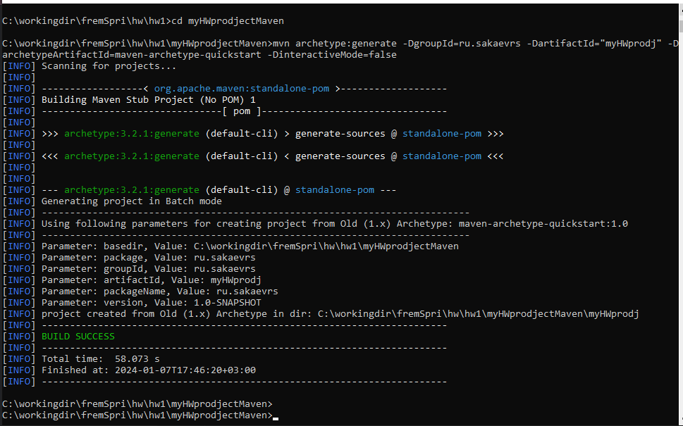

# Фреймворк Spring (семинары)
## Урок 1. Системы сборки Maven и Gradle для разработки Java приложений
__Создать проект с использованием Maven или Gradle, добавить в него несколько зависимостей и написать код, использующий эти зависимости.__
### Задание:
1. Создайте новый Maven или Gradle проект, следуя инструкциям из блока 1 или блока 2.
2. Добавьте зависимости org.apache.commons:commons-lang3:3.12.0 и com.google.code.gson:gson:2.8.6.
3. Создайте класс Person с полями firstName, lastName и age.
4. Используйте библиотеку commons-lang3 для генерации методов toString, equals и hashCode.
5. Используйте библиотеку gson для сериализации и десериализации объектов класса Person в формат JSON.

### Решение:
#### 1. Установка:
- Скачиваем архив для Win (https://dlcdn.apache.org/maven/maven-3/3.9.6/binaries/apache-maven-3.9.6-bin.zip) или Unix (https://dlcdn.apache.org/maven/maven-3/3.9.6/binaries/apache-maven-3.9.6-bin.tar.gz)
- Распаковываем в нужную директорию (в моём случае C:\Program Files)
- В Свойствах системы -> Дополнительные параметры системы -> Переменные -> Системные переменные выбираем __Path__ и добавляем путь до папки из архива __bin__ (C:\Program Files\apache-maven-3.9.6\bin) или (C:\Program Files\gradle-8.5\bin)
- Для работы с Maven и Gradle нужна Java, проверяем их установку в командной строке:
~~~
java -version
mvn -version
gradle -version
~~~
- В командной строке (CMD) cоздаём (mkdir C:\workingdir\fremSpri\hw\hw1\myHWprodjectMaven) и переходим в директорию с проектом: __cd myHWprodjectMaven__.
- Создаём проект с помощью следующей команды:
~~~
mvn archetype:generate -DgroupId=ru.sakaevrs -DartifactId="myHWprodj" -DarchetypeArtifactId=maven-archetype-quickstart -DinteractiveMode=false
~~~

#### 2. Устанавливаем зависимости с сайта https://mvnrepository.com/:
- Открываем проект в IntelliJ IDEA, находим __pom.xml__, открываем в текстовом редакторе или IDE и вставляем внутри тега <dependencies> следующие строки:
```xml
<dependencies>
    <!-- Добавление зависимости Apache Commons Lang -->
    <dependency>
        <groupId>org.apache.commons</groupId>
        <artifactId>commons-lang3</artifactId>
        <version>3.12.0</version>
    </dependency>

    <!-- Добавление зависимости Google Gson -->
    <dependency>
        <groupId>com.google.code.gson</groupId>
        <artifactId>gson</artifactId>
        <version>2.8.6</version>
    </dependency>
</dependencies>
```
### 3. Создаю класс Person с полями firstName, lastName и age в папке __src\main\java\ru\sakaevrs__:
~~~java
public class Person {
    private String firstName;
    private String lastName;
    private int age;

    // Конструктор
    public Person(String firstName, String lastName, int age) {
        this.firstName = firstName;
        this.lastName = lastName;
        this.age = age;
    }

    // Геттеры и сеттеры
    public String getFirstName() {
        return firstName;
    }

    public void setFirstName(String firstName) {
        this.firstName = firstName;
    }

    public String getLastName() {
        return lastName;
    }

    public void setLastName(String lastName) {
        this.lastName = lastName;
    }

    public int getAge() {
        return age;
    }

    public void setAge(int age) {
        this.age = age;
    }

    // Метод для отображения информации о человеке
    @Override
    public String toString() {
        return "Person{" +
                "firstName='" + firstName + '\'' +
                ", lastName='" + lastName + '\'' +
                ", age=" + age +
                '}';
    }
}
~~~
### 4. Использую библиотеку commons-lang3 для генерации методов toString, equals и hashCode.
Для этого в класс Person вносим следующие изменения:
```java
import org.apache.commons.lang3.builder.ToStringBuilder;
import org.apache.commons.lang3.builder.EqualsBuilder;
import org.apache.commons.lang3.builder.HashCodeBuilder;

public class Person {
    private final String firstName;
    private final String lastName;
    private final int age;

    public Person(String firstName, String lastName, int age) {
        this.firstName = firstName;
        this.lastName = lastName;
        this.age = age;
    }

    @Override
    public String toString() {
        return new ToStringBuilder(this)
                .append("firstName", firstName)
                .append("lastName", lastName)
                .append("age", age)
                .toString();
    }

    @Override
    public boolean equals(Object obj) {
        if (this == obj) return true;
        if (obj == null || getClass() != obj.getClass()) return false;
        Person person = (Person) obj;
        return new EqualsBuilder()
                .append(age, person.age)
                .append(firstName, person.firstName)
                .append(lastName, person.lastName)
                .isEquals();
    }

    @Override
    public int hashCode() {
        return new HashCodeBuilder(17, 37)
                .append(firstName)
                .append(lastName)
                .append(age)
                .toHashCode();
    }
}
```
Где:
- __ToStringBuilder__ используется для создания строкового представления объекта Person.
- __EqualsBuilder__ используется для реализации метода equals, который проверяет равенство объектов Person.
- __HashCodeBuilder__ используется для генерации хэш-кода объекта Person.
### 5. Использую библиотеку gson для сериализации и десериализации объектов класса Person в формат JSON.
- В классе Main создаем экземпляр Person.
- Затем создаем экземпляр Gson.
- используем gson.toJson(person) для сериализации объекта Person в строку JSON.
- используем gson.fromJson(json, Person.class) для десериализации строки JSON обратно в объект Person.
```java
import com.google.gson.Gson;
public class Main {
    public static void main(String[] args) {
        // Создание объекта Person
        Person person = new Person("Иван", "Иванов", 30);

        // Создание экземпляра Gson
        Gson gson = new Gson();

        // Сериализация (конвертация объекта в JSON)
        String json = gson.toJson(person);
        System.out.println("Сериализованный объект в JSON: " + json);

        // Десериализация (конвертация JSON обратно в объект)
        Person personFromJson = gson.fromJson(json, Person.class);
        System.out.println("Десериализованный объект из JSON: " + personFromJson);
    }
}
```