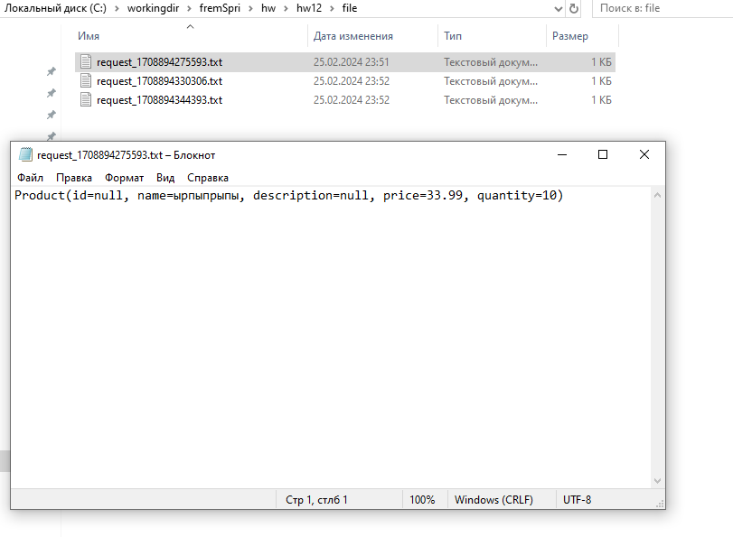

# Фреймворк Spring (семинары)
## Урок 12. Паттерны проектирония и GoF паттерны в Spring приложении
### Задание:
1) На базе первого примера разобранного на семинаре, добавить в один из проектов разработанных ранее spring Integration. 
2) Сохранять запросы от пользователя в файл.
Добавим зависимости:
```xml
<dependency>
			<groupId>org.springframework.boot</groupId>
			<artifactId>spring-boot-starter-integration</artifactId>
		</dependency>
		<dependency>
			<groupId>org.springframework.integration</groupId>
			<artifactId>spring-integration-http</artifactId>
		</dependency>
		<dependency>
			<groupId>org.springframework.integration</groupId>
			<artifactId>spring-integration-file</artifactId>
		</dependency>
		<dependency>
			<groupId>org.springframework.integration</groupId>
			<artifactId>spring-integration-test</artifactId>
			<scope>test</scope>
		</dependency>
```
Создадим класс интеграции для сохранения запросов в файл в пакете ru.sakaev.backEndApp.configuration:
```java
package ru.sakaev.backEndApp.configuration;

import org.springframework.beans.factory.annotation.Autowired;
import org.springframework.context.annotation.Bean;
import org.springframework.integration.annotation.MessagingGateway;
import org.springframework.integration.annotation.ServiceActivator;
import org.springframework.integration.channel.DirectChannel;
import org.springframework.integration.config.EnableIntegration;
import org.springframework.integration.file.FileWritingMessageHandler;
import org.springframework.messaging.MessageChannel;
import org.springframework.messaging.handler.annotation.Header;
import org.springframework.stereotype.Component;

import java.io.File;

@Component
@EnableIntegration
public class FileWritingIntegration {

    @Autowired
    private ProductGateway productGateway;

    @Bean
    public MessageChannel requestChannel() {
        return new DirectChannel();
    }

    @Bean
    @ServiceActivator(inputChannel = "requestChannel")
    public FileWritingMessageHandler fileWriter() {
        FileWritingMessageHandler handler = new FileWritingMessageHandler(new File("C:/workingdir/fremSpri/hw/hw12/file"));
        handler.setExpectReply(false);
        handler.setAppendNewLine(true);
        handler.setFileNameGenerator(message -> "request_" + System.currentTimeMillis() + ".txt");
        return handler;
    }

    @MessagingGateway(defaultRequestChannel = "requestChannel")
    public interface ProductGateway {
        void writeToFile(@Header("http_requestMethod") String method, @Header("http_requestUrl") String url, String payload);
    }
}

```
Изменим контроллер для отправки запросов на обработку:
```java
package ru.sakaev.backEndApp.controller;

import java.util.List;

import org.springframework.beans.factory.annotation.Autowired; // Импорт аннотации для внедрения зависимостей
import org.springframework.http.HttpStatus; // Импорт HTTP-статусов
import org.springframework.http.ResponseEntity; // Импорт ResponseEntity для HTTP-ответов
import org.springframework.transaction.annotation.Transactional; // Импорт аннотации Transactional для определения транзакционного поведения
import org.springframework.ui.Model; // Импорт Model для взаимодействия с интерфейсом пользователя
import org.springframework.web.bind.annotation.*; // Импорт аннотаций для определения RESTful-конечных точек

import ru.sakaev.backEndApp.configuration.FileWritingIntegration;
import ru.sakaev.backEndApp.model.Product; // Импорт класса модели Product
import ru.sakaev.backEndApp.service.ProductService; // Импорт класса ProductService

import io.micrometer.core.instrument.MeterRegistry;
import io.micrometer.core.instrument.Timer;


@RestController // Аннотация, указывающая, что этот класс будет обрабатывать RESTful-запросы и ответы
@RequestMapping("/api/products") // Базовое URL-сопоставление для всех конечных точек в этом контроллере
public class ProductController { // Объявление класса ProductController

    private final ProductService productService; // Объявление экземпляра ProductService
    private final FileWritingIntegration.ProductGateway productGateway; // Интерфейс для отправки данных в файл

    private final MeterRegistry meterRegistry;

    @Autowired
    public ProductController(ProductService productService, MeterRegistry meterRegistry, FileWritingIntegration.ProductGateway productGateway) {
        this.productService = productService;
        this.meterRegistry = meterRegistry;
        this.productGateway = productGateway;
    }

    @GetMapping
    @Transactional(readOnly = true)
    public ResponseEntity<List<Product>> getAllProducts() {
        Timer.Sample sample = Timer.start(meterRegistry); // Начало измерения времени выполнения
        List<Product> products = productService.getAllProducts();
        sample.stop(meterRegistry.timer("product.controller.getAllProducts")); // Остановка измерения и регистрация метрики
        meterRegistry.counter("product.controller.getAllProducts.count").increment(); // Увеличение счетчика вызовов метода
        return new ResponseEntity<>(products, HttpStatus.OK);
    }

    @GetMapping("/{id}") // Обработчик GET запроса для получения продукта по ID
    @Transactional(readOnly = true) // Транзакционное поведение метода только для чтения
    public ResponseEntity<Product> getProductById(@PathVariable Long id) { // Метод получения продукта по ID
        Product product = productService.getProductById(id); // Получение продукта по ID через сервис
        if (product != null) { // Если продукт найден
            productGateway.writeToFile("GET", "/api/products/" + id, product.toString()); // Запись данных о запросе в файл
            return new ResponseEntity<>(product, HttpStatus.OK); // Возвращаем продукт с HTTP-статусом ОК
        } else { // Если продукт не найден
            return new ResponseEntity<>(HttpStatus.NOT_FOUND); // Возвращаем HTTP-статус NOT FOUND
        }
    }

    @PostMapping("/create") // Аннотация для обработки HTTP-запросов типа POST для создания нового ресурса
    @Transactional // Аннотация, определяющая транзакционное поведение метода
    @ResponseStatus(HttpStatus.CREATED) // Аннотация, указывающая код состояния HTTP для успешного создания
    public Product createProduct(@RequestBody Product product) { // Метод для создания нового продукта
        // Отправка данных о запросе в файл
        productGateway.writeToFile("POST", "/api/products/create", product.toString());
        return productService.createProduct(product); // Вызов сервиса для создания нового продукта
    }

    @PutMapping("/{id}") // Обработчик PUT запроса для обновления существующего продукта
    @Transactional // Транзакционное поведение метода
    public ResponseEntity<Product> updateProduct(@PathVariable Long id, @RequestBody Product product) { // Метод обновления продукта
        productGateway.writeToFile("PUT", "/api/products/" + id, product.toString()); // Запись данных о запросе в файл
        Product updatedProduct = productService.updateProduct(id, product); // Обновление продукта через сервис
        if (updatedProduct != null) { // Если продукт успешно обновлен
            return new ResponseEntity<>(updatedProduct, HttpStatus.OK); // Возвращаем обновленный продукт с HTTP-статусом ОК
        } else { // Если продукт не найден
            return new ResponseEntity<>(HttpStatus.NOT_FOUND); // Возвращаем HTTP-статус NOT FOUND
        }
    }

    @DeleteMapping("/{id}") // Обработчик DELETE запроса для удаления продукта по ID
    @Transactional // Транзакционное поведение метода
    public ResponseEntity<Void> deleteProduct(@PathVariable Long id) { // Метод удаления продукта
        productGateway.writeToFile("DELETE", "/api/products/" + id, ""); // Запись данных о запросе в файл
        productService.deleteProduct(id); // Удаление продукта через сервис
        return new ResponseEntity<>(HttpStatus.NO_CONTENT); // Возвращаем HTTP-статус NO CONTENT
    }
}
```

3) Добавить в проект один из паттернов разобранных на лекции.
- Добавим поведенческий паттерн Observer в проект:
  1) Определим интерфейс Observer и Subject.
```java
import java.util.ArrayList;
import java.util.List;

interface Observer {
    void update(String message);
}

// Интерфейс Subject, представляющий субъект, который может иметь наблюдателей и уведомлять их об изменениях
interface Subject {
    void addObserver(Observer observer);
    void removeObserver(Observer observer);
    void notifyObservers(String message);
}
```
  2) Реализуем классы, которые будут являться конкретными субъектами и наблюдателями.
```java
class Product implements Subject {
    private List<Observer> observers = new ArrayList<>();
    private String name;

    public Product(String name) {
        this.name = name;
    }

    public void setName(String name) {
        this.name = name;
        notifyObservers("Product name has been changed to: " + name);
    }

    @Override
    public void addObserver(Observer observer) {
        observers.add(observer);
    }

    @Override
    public void removeObserver(Observer observer) {
        observers.remove(observer);
    }

    @Override
    public void notifyObservers(String message) {
        for (Observer observer : observers) {
            observer.update(message);
        }
    }
}
```
```java
class Client implements Observer {
    private String name;

    public Client(String name) {
        this.name = name;
    }

    @Override
    public void update(String message) {
        System.out.println(name + " received message: " + message);
    }
}
```
  3) Изменим существующие классы так, чтобы они соответствовали паттерну Observer.
```java
public class ObserverPatternExample {
    public static void main(String[] args) {
        // Создание субъекта (продукта)
        Product product = new Product("Smartphone");

        // Создание наблюдателей (клиентов)
        Observer client1 = new Client("Client 1");
        Observer client2 = new Client("Client 2");

        // Добавление наблюдателей к субъекту
        product.addObserver(client1);
        product.addObserver(client2);

        // Изменение субъекта и уведомление наблюдателей
        product.setName("Tablet");
    }
}
```