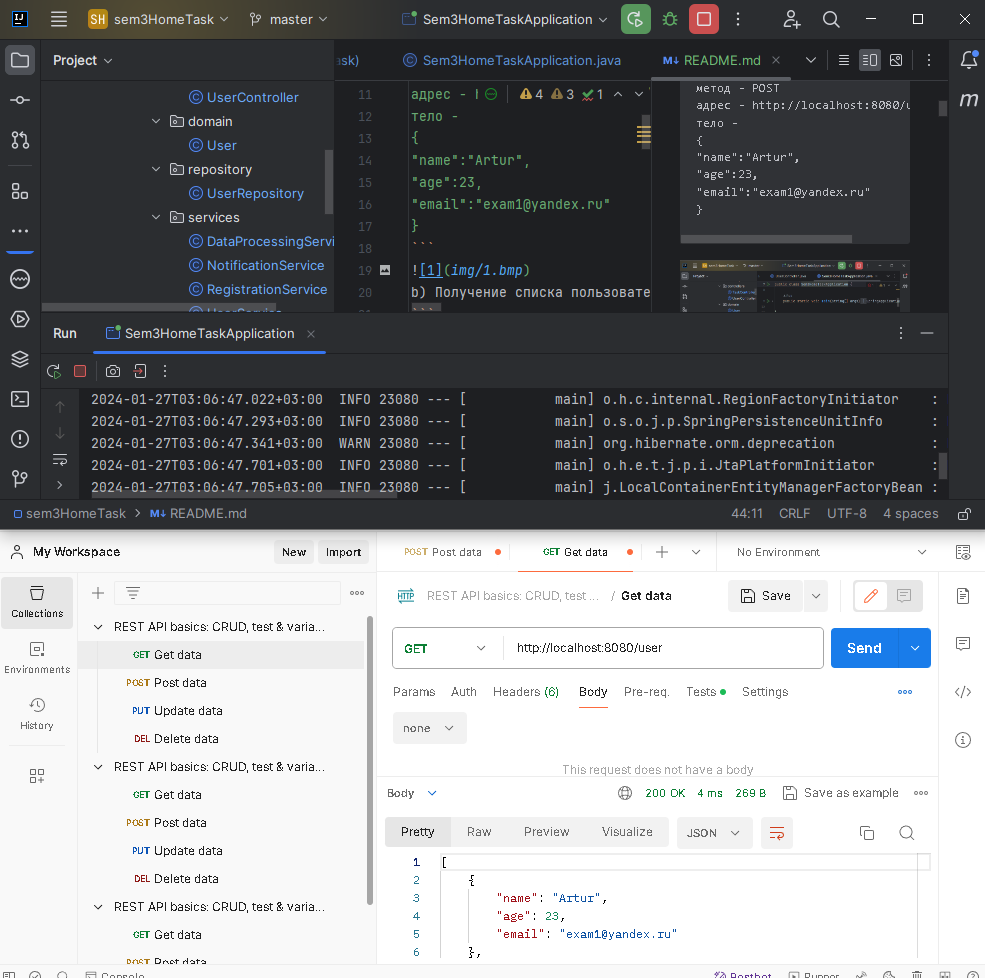
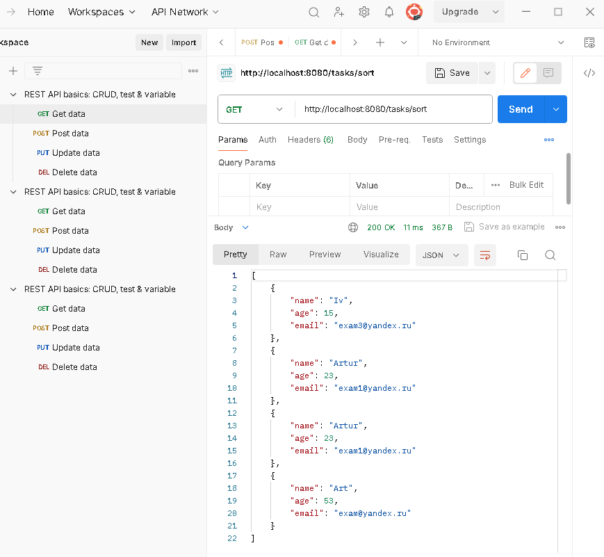
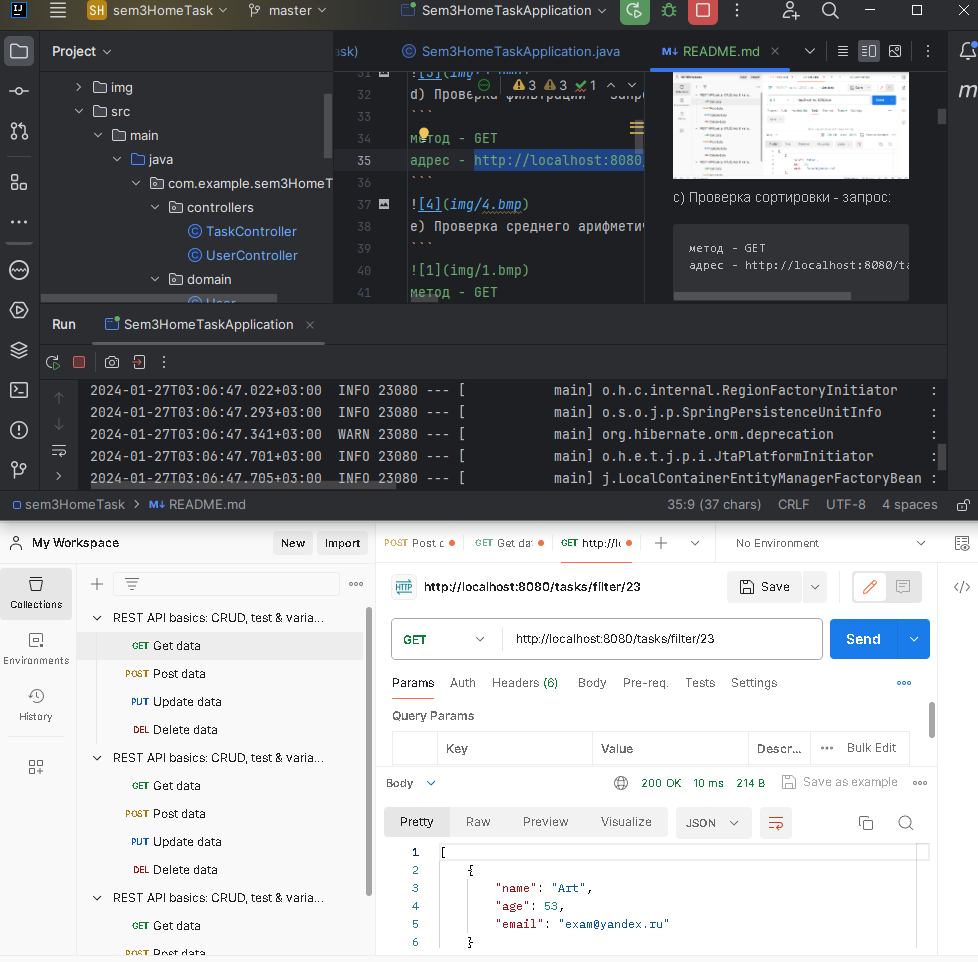
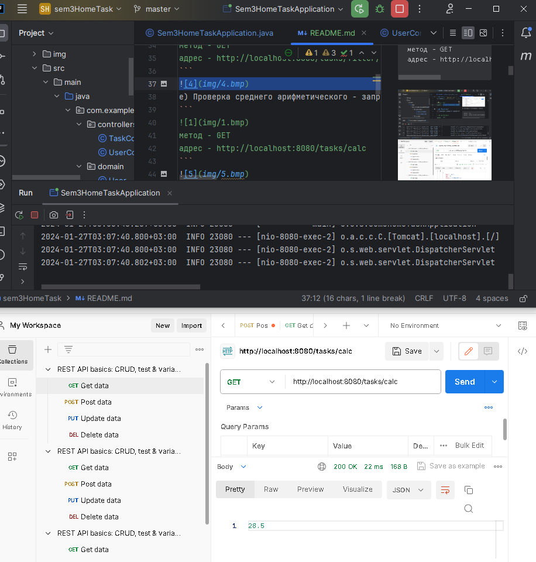
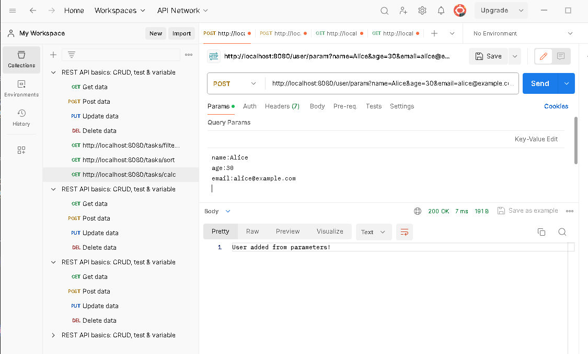
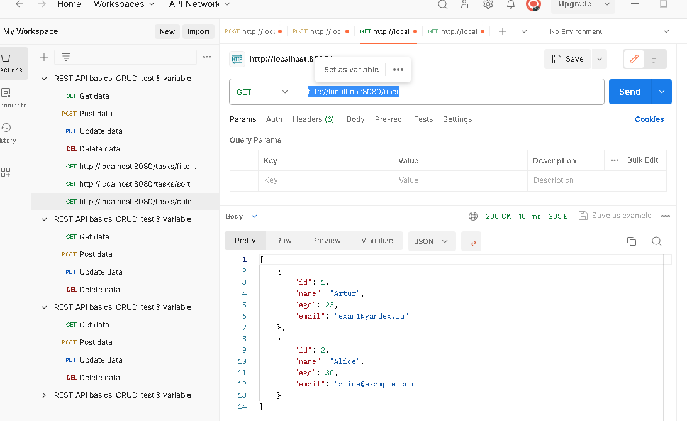

# Фреймворк Spring (семинары)
## Урок 3. Использование Spring для разработки серверного приложения
### Задание: Используя Spring, создайте серверное REST приложение. Добавить функционал в приложение разработанное на семинаре:

=============================== Проверка работы ====================================

Для тестирования проекта использовать программу PostMan:
- a) Добавление пользователя - запрос:
```
метод - POST
адрес - http://localhost:8080/user/body
тело -
{
"name":"Artur",
"age":23,
"email":"exam1@yandex.ru"
}
```

b) Получение списка пользователей на сервере - запрос:
```
метод - GET
адрес - http://localhost:8080/user
```

c) Проверка сортировки - запрос:
```
метод - GET
адрес - http://localhost:8080/tasks/sort
```

d) Проверка фильтрации - запрос:
```
метод - GET
адрес - http://localhost:8080/tasks/filter/23
```

e) Проверка среднего арифметического - запрос:
```

метод - GET
адрес - http://localhost:8080/tasks/calc
```

==================================_________=======================================

#### Базовое задание
1) В класс RegistrationService добавить поля UserService, NotificationService(добавить в IOC контейнер аннотацией @Autowired или через конструктор класса):
- - - 
- - Для реализации заданного функционала в классе RegistrationService необходимо добавить поля UserService и NotificationService. 
- - Буду использовать внедрение зависимостей через конструктор, так как это повышает тестируемость кода и улучшает управление зависимостями.
- - Класс RegistrationService будет выглядеть так:
```java
@Service
public class RegistrationService {

    private final DataProcessingService dataProcessingService;
    private final UserService userService;
    private final NotificationService notificationService;

    /**
     * Конструктор для внедрения зависимостей.
     * @param dataProcessingService служба для обработки данных пользователей
     * @param userService служба для создания новых пользователей
     * @param notificationService служба для отправки уведомлений
     */
    @Autowired
    public RegistrationService(DataProcessingService dataProcessingService, UserService userService, NotificationService notificationService) {
        this.dataProcessingService = dataProcessingService;
        this.userService = userService;
        this.notificationService = notificationService;
    }

    /**
     * Обрабатывает регистрацию нового пользователя.
     * Создает нового пользователя, добавляет его в репозиторий и отправляет уведомление.
     * @param name имя пользователя
     * @param age возраст пользователя
     * @param email электронная почта пользователя
     */
    public void processRegistration(String name, int age, String email) {
        // Создание нового пользователя
        User newUser = userService.createUser(name, age, email);

        // Добавление пользователя в репозиторий
        dataProcessingService.addUserToList(newUser);

        // Отправка уведомления
        notificationService.notifyUser(newUser);
    }

    // Геттеры

    public DataProcessingService getDataProcessingService() {
        return dataProcessingService;
    }

    public UserService getUserService() {
        return userService;
    }

    public NotificationService getNotificationService() {
        return notificationService;
    }

}


```
- - Внедрение зависимостей через конструктор: это предпочтительный метод внедрения зависимостей в Spring Framework, так как он облегчает написание модульных тестов и улучшает управление зависимостями.
- - Обработка регистрации пользователя: метод processRegistration создает нового пользователя, добавляет его в список пользователей через DataProcessingService и отправляет уведомление через NotificationService.
- - Геттеры: предоставляют доступ к внедренным сервисам, что может быть полезно, например, для тестирования или других операций внутри приложения.
- - -
2) Разработать метод processRegistration в котором:
- создается пользователь из параметров метода
- созданный пользователь добавляется в репозиторий
- через notificationService выводится сообщение в консоль
- - -
- - Для реализации метода processRegistration будем следовать следующим шагам:
- - - Создать пользователя (User) из параметров метода.
- - - Добавить созданного пользователя в репозиторий.
- - - Использовать NotificationService для вывода сообщения в консоль.
- - Таким образом метод processRegistration в классе RegistrationService будет выглядеть так:
```java
@Service
public class RegistrationService {

    private final DataProcessingService dataProcessingService;
    private final UserService userService;
    private final NotificationService notificationService;

    @Autowired
    public RegistrationService(DataProcessingService dataProcessingService,
                               UserService userService,
                               NotificationService notificationService) {
        this.dataProcessingService = dataProcessingService;
        this.userService = userService;
        this.notificationService = notificationService;
    }

    /**
     * Обрабатывает регистрацию нового пользователя.
     * @param name Имя пользователя
     * @param age Возраст пользователя
     * @param email Электронная почта пользователя
     */
    public void processRegistration(String name, int age, String email) {
        // Создание нового пользователя
        User newUser = userService.createUser(name, age, email);

        // Добавление пользователя в репозиторий
        dataProcessingService.addUserToList(newUser);

        // Отправка уведомления
        String notificationMessage = "New user registered: " + newUser.getName() + ", Age: " + newUser.getAge() + ", Email: " + newUser.getEmail();
        notificationService.sendNotification(notificationMessage);
    }

    // Геттеры для внедрённых сервисов
    public DataProcessingService getDataProcessingService() {
        return dataProcessingService;
    }

    public UserService getUserService() {
        return userService;
    }

    public NotificationService getNotificationService() {
        return notificationService;
    }
}
```
- Метод createUser из UserService используется для создания нового пользователя.
- Метод addUserToList из DataProcessingService добавляет пользователя в репозиторий.
- Метод sendNotification из NotificationService выводит сообщение в консоль.
- - -
3) В TaskController добавить обработчики filterUsersByAge()(Подсказка @GetMapping("/filter/{age}")) и calculateAverageAge (Подсказка @GetMapping("/calc"))
4) В методе filterUsersByAge параметр age получать через аннотацию @PathVariable
- - -
- Чтобы добавить обработчики для filterUsersByAge() и calculateAverageAge() в TaskController, нужно определить два новых метода в этом контроллере. 
- Эти методы будут использовать DataProcessingService для выполнения соответствующих операций.
- TaskController будет выглядеть так:
```java
@RestController
@RequestMapping("/tasks") // базовый URL для контроллера
public class TaskController {

    private final DataProcessingService dataProcessingService;

    @Autowired
    public TaskController(DataProcessingService dataProcessingService) {
        this.dataProcessingService = dataProcessingService;
    }

    @GetMapping("/filter/{age}")
    public ResponseEntity<List<User>> filterUsersByAge(@PathVariable int age) {
        List<User> filteredUsers = dataProcessingService.filterUsersByAge(age);
        return ResponseEntity.ok(filteredUsers);
    }

    @GetMapping("/calc")
    public ResponseEntity<Double> calculateAverageAge() {
        double averageAge = dataProcessingService.calculateAverageAge();
        return ResponseEntity.ok(averageAge);
    }
}
```
- где:
- - filterUsersByAge(@PathVariable int age) принимает возраст как параметр пути и возвращает список пользователей, чей возраст больше переданного значения.
- - calculateAverageAge() возвращает средний возраст всех пользователей.
- - -

### Описание структуры проекта:
### Domain
__User__: Простой POJO класс, представляющий пользователя.
### Repository
- __UserRepository__: Имитирует базу данных с использованием ArrayList, позволяя осуществлять операции добавления и поиска пользователей.
Services
- __DataProcessingService__: Предоставляет методы для обработки данных пользователей, такие как сортировка, фильтрация и расчет среднего возраста.
- __NotificationService__: Служба для отправки уведомлений пользователям.
- __RegistrationService__: Обрабатывает регистрацию новых пользователей.
- __UserService__: Управляет операциями, связанными с пользователями, включая добавление пользователя в репозиторий и уведомление.
### Controllers
- __UserController__: Контроллер для обработки HTTP запросов, связанных с пользователями.
### Application Entry Point
- __Sem3HomeTaskApplication__: Точка входа для запуска Spring Boot приложения.
### Dependencies in Maven (pom.xml)
- __Spring Boot Starter Web__: Для создания веб-приложения.
- __Spring Boot Starter Test__: Для тестирования.
- __H2 Database__: В качестве базы данных для тестирования/разработки.
- __Spring Boot Starter Data JPA__: Для работы с базой данных.
### Configuration (application.properties)
- Конфигурация H2 Database.
- - -
#### Задание со звездочкой
1) В классе UserController добавить обработчик userAddFromParam извлекающий данные для создания пользователя из параметров HTTP запроса
- Добавим метод userAddFromParam. 
- Нужно определить новый метод с аннотацией @PostMapping и использовать аннотации @RequestParam для извлечения параметров запроса:
```java
/**
     * Добавляет пользователя из параметров HTTP запроса.
     * @param name Имя пользователя
     * @param age Возраст пользователя
     * @param email Электронная почта пользователя
     * @return Сообщение об успешном добавлении пользователя
     */
@PostMapping("/param")
public String userAddFromParam(@RequestParam String name,
                               @RequestParam int age,
                               @RequestParam String email) {
    service.processRegistration(name, age, email);
    return "User added from parameters!";
}
```
- Метод userAddFromParam помечен аннотацией @PostMapping и использует аннотации @RequestParam для извлечения параметров запроса (name, age, email).
- Создается новый пользователь из полученных параметров и добавляется в репозиторий.
- Метод возвращает сообщение об успешном добавлении пользователя.
- - В поле метода запроса выбираем POST (в Postman)
- - Вводим ключи и значения для параметров name, age, и email. 
- - Например, ключ: name, значение: Alice, age:30, email:alice@example.com (http://localhost:8080/user/param?name=Alice&age=30&email=alice@example.com)
2) Перенести репозиторий проекта с List<User> на базу данных H2
- Перенос репозитория проекта с List<User> на базу данных H2 включает несколько ключевых шагов, а именно:
- a) Создание сущности User:
```java
@Entity
public class User {
    @Id
    @GeneratedValue(strategy = GenerationType.AUTO)
    private Long id;
    ...
}
```
- b) Удаление старого List<User> репозитория:
```java
@Component
public class UserRepository {

    public List<User> getUsers() {
        return users;
    }

    public void setUsers(List<User> users) {
        this.users = users;
    }

    private List<User> users = new ArrayList<>();

}
```
- c) Создайте интерфейс UserRepository, расширяющий JpaRepository:
```java
public interface UserRepository extends JpaRepository<User, Long> {
    
}
```
- d) Обновление сервисов DataProcessingService и других, которые используют UserRepository, чтобы они работали с новым интерфейсом JPA:
- - такие методы как addUserToList, больше не нужны, так как JPA-репозиторий предоставляет встроенные методы для таких операций.
```java
@Service
public class DataProcessingService {

    @Autowired
    private UserRepository repository;

    // Методы getUsers и setUsers больше не нужны

    public List<User> sortUsersByAge() {
        return repository.findAll().stream()
                .sorted(Comparator.comparing(User::getAge))
                .collect(Collectors.toList());
    }

    public List<User> filterUsersByAge(int age) {
        // будем использовать API потоков
        return repository.findAll().stream()
                .filter(user -> user.getAge() > age)
                .collect(Collectors.toList());
    }

    public double calculateAverageAge() {
        return repository.findAll().stream()
                .mapToInt(User::getAge)
                .average()
                .orElse(0);
    }

    public void saveUser(User user) {
        repository.save(user);
    }
}
```
- Отправляем параметризованный запрос: 
- 
- По запросу http://localhost:8080/user получаем ответ:
- 